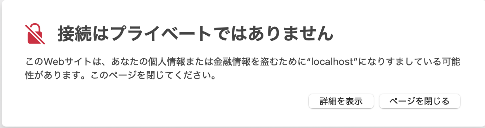
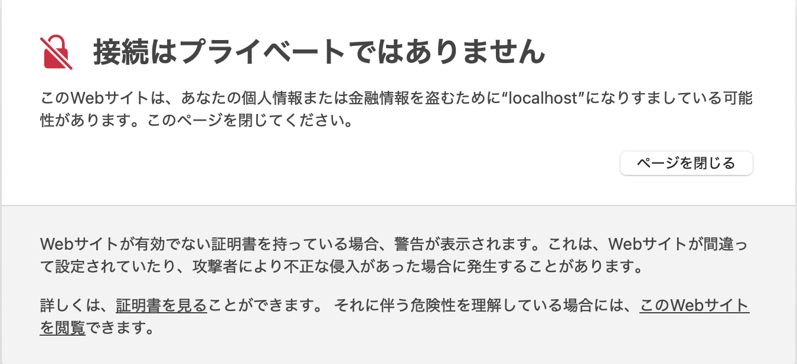
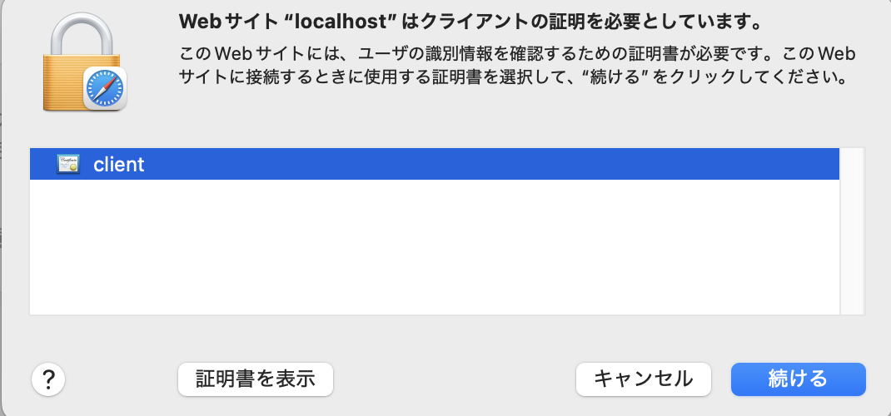
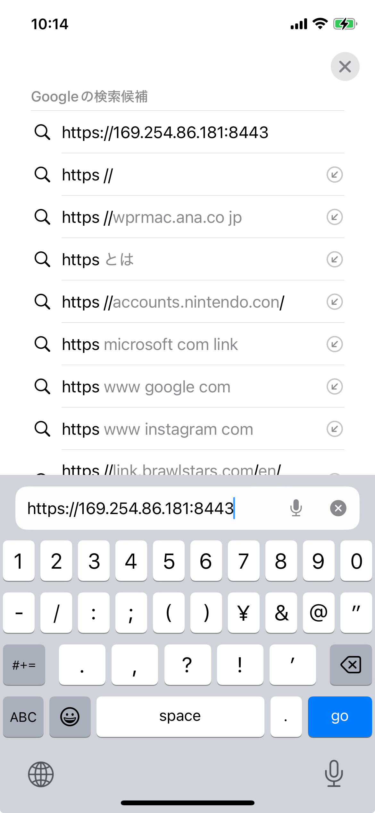
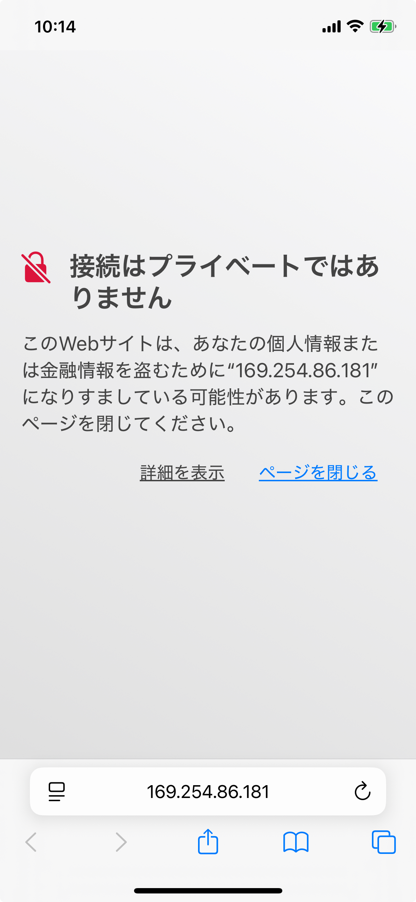
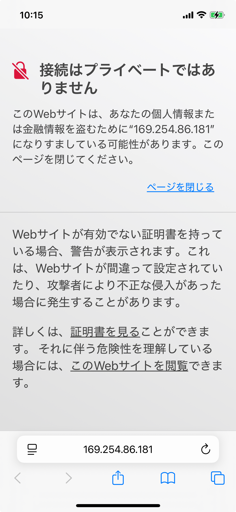
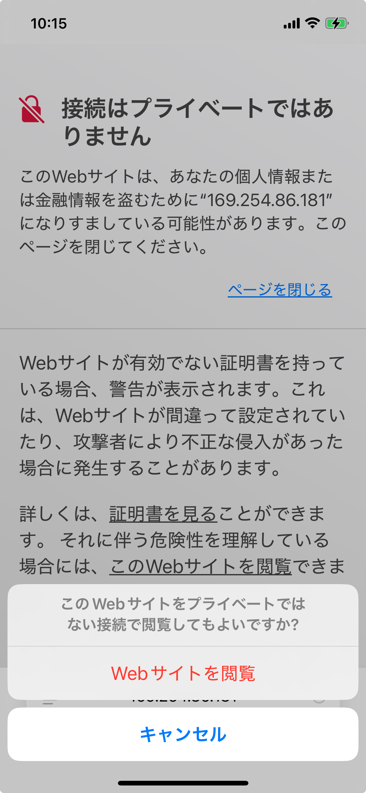
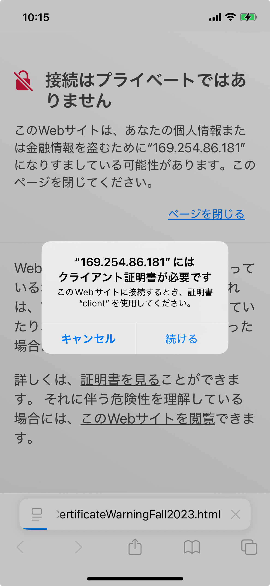
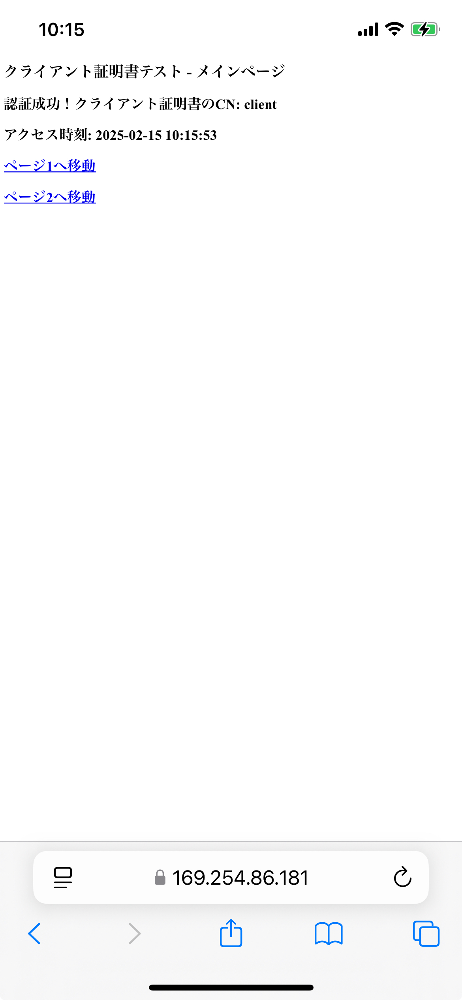
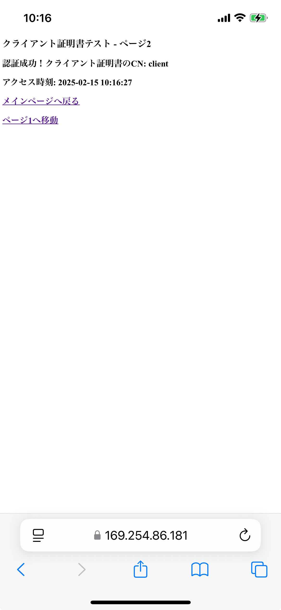

# クライアント証明書認証の実装ガイド

## 目次

1. [概要](#概要)
2. [前提条件](#前提条件)
3. [証明書の作成](#証明書の作成)
4. [サーバーサイドの実装](#サーバーサイドの実装)
5. [証明書のインストール](#証明書のインストール)
6. [プラットフォーム別の動作の違い](#プラットフォーム別の動作の違い)
7. [動作確認](#動作確認)
8. [トラブルシューティング](#トラブルシューティング)
9. [運用上の考慮事項](#運用上の考慮事項)

## 概要

このガイドでは、クライアント証明書認証を使用したWebアプリケーションの実装方法について説明します。自己署名証明書の作成から、サーバーサイドの実装、各プラットフォームでの証明書のインストール方法まで、順を追って解説します。

## 前提条件

- macOS（開発環境）
- Go 1.16以上
- OpenSSL
- 検証用デバイス（macOS, iOS）

## TL;DR

### 1. macOSのSafariでの動作

- 自己署名証明書のため、Safariが接続のプライバシー保護について警告を表示しています。

    

- 詳細を表示した状態でも、Safariは自己署名証明書による接続の危険性を改めて警告しています。

    

- プライベートでない接続でWebサイトを閲覧するかどうかをSafariが確認しています。

    

- Webサイトがクライアント証明書を要求し、証明書の選択を促すSafariの画面です。
    - この画面は**macOSでは履歴のクリアやブラウザの再起動を行わなくても、必ず毎回表示されてしまいます。**

    

- クライアント証明書による認証が成功し、Webページが表示されました。
    - 同一セッション内での画面遷移ではクライアント証明書の選択をうながすダイアログは表示されません。

    

### 2. iOSのSafariでの動作

- **iOSでは、ブラウザの終了と開始を行っても、履歴をクリアしない限り、証明書の選択をうながすダイアログは表示されません。**
    - 履歴をクリアし、ブラウザを再起動すると、証明書の選択をうながすダイアログが表示されます。

- iOS SafariでWebサーバーのURLを入力しアクセスを試みている画面です。

    

- 自己署名証明書のため、iOS Safariが接続のプライバシー保護に関する警告を表示しています。

    

- 詳細を表示した状態でも、iOS Safariは自己署名証明書による接続の危険性を改めて警告しています。

    

- プライベートでない接続でWebサイトを閲覧するかどうかをiOS Safariが確認しています。

    

- Webサイトがクライアント証明書を要求し、証明書の選択を促すiOS Safariのダイアログです。

    

- クライアント証明書による認証が成功し、Webページのメインページが表示されました。

    

- メインページからページ1へ移動した後の画面です。
    - 証明書の選択をうながすダイアログは表示されません。

    

- ページ1からページ2へ移動した後の画面です。
    - 証明書の選択をうながすダイアログは表示されません。

    

## 証明書の作成

### 1. 作業ディレクトリの作成

```bash
mkdir client-cert-demo
cd client-cert-demo
# 証明書の格納ディレクトリ作成 & 移動
mkdir certs_files
cd certs_files
```

### 2. ルート証明書の作成

certs_filesディレクトリでの作業を想定

```bash
# プライベートキーの生成
openssl genrsa -out rootCA.key 2048
# オプションの説明
# genrsa: RSA秘密鍵の生成
# -out: 出力ファイル名
# 2048: 鍵の長さ（ビット）

# 自己署名ルート証明書の生成
openssl req -x509 -new -nodes -key rootCA.key -sha256 -days 1024 -out rootCA.pem -subj "/C=JP/ST=Tokyo/L=Tokyo/O=MyOrg/CN=My Root CA"
# オプションの説明
# req: 証明書要求の生成
# -x509: 自己署名証明書の生成
# -new: 新規要求
# -nodes: 秘密鍵を暗号化しない
# -key: 使用する秘密鍵
# -sha256: 署名アルゴリズム
# -days: 有効期間（日数）
# -subj: 証明書情報（国、都道府県、市町村、組織、コモンネーム）
```

### 3. サーバー証明書の作成

```bash
# サーバー用の秘密鍵生成
openssl genrsa -out server.key 2048

# サーバー証明書のCSR（証明書署名要求）生成
openssl req -new -key server.key -out server.csr -subj "/C=JP/ST=Tokyo/L=Tokyo/O=MyOrg/CN=localhost"

# サーバー証明書の生成
openssl x509 -req -in server.csr -CA rootCA.pem -CAkey rootCA.key -CAcreateserial -out server.pem -days 365 -sha256
# オプションの説明
# -req: CSRからの証明書生成
# -CA: 署名に使用するCA証明書
# -CAkey: CA秘密鍵
# -CAcreateserial: シリアル番号の生成
```

### 4. クライアント証明書の作成

```bash
# クライアント用の秘密鍵生成
openssl genrsa -out client.key 2048

# クライアント証明書のCSR生成
openssl req -new -key client.key -out client.csr -subj "/C=JP/ST=Tokyo/L=Tokyo/O=MyOrg/CN=client"

# クライアント証明書の生成
openssl x509 -req -in client.csr -CA rootCA.pem -CAkey rootCA.key -CAcreateserial -out client.pem -days 365 -sha256

# PFX形式への変換（パスワード設定が必要）
openssl pkcs12 -export -out client.pfx -inkey client.key -in client.pem -certfile rootCA.pem
# オプションの説明
# pkcs12: PKCS#12形式への変換
# -export: エクスポート
# -certfile: 証明書チェーンに含めるCA証明書
# 生成時にパスワードを設定するプロンプトが表示されるので、任意のパスワードを設定すること
```

### 5. サーバー証明書のPFX形式への変換

```bash
openssl pkcs12 -export -out server.pfx -inkey server.key -in server.pem -certfile rootCA.pem
```

## サーバーサイドの実装

### 1. Goファイルの作成

`main.go`を作成し、以下の内容を実装します

- 各種証明書のファイル・ディレクトリ構成と読み込み
    - cert_files/rootCA.pem（ルート証明書）
    - cert_files/server.pem（サーバー証明書）
    - cert_files/server.key（サーバーの秘密鍵）
    - main.go（本体）
- コードの必須構成要素
    - 証明書関連の設定
    - ルート証明書の読み込み（os.ReadFile）
    - 証明書プールの作成（x509.NewCertPool）
    - TLS設定の構成（ClientCAs, ClientAuth）
- HTTPサーバーの基本設定
    - ポート指定（:8443）
    - TLS設定の適用
    - ルーティング設定
- ルーティング設定
    - マルチプレクサの作成（http.NewServeMux）
    - 同一セッション内で再認証を求められるかどうかの検証要の各パスのハンドラー登録（/, /page1, /page2）
- クライアント証明書の処理
    - 証明書情報のログ出力機能（logCertificateInfo）
    - 証明書のCN取得機能（getCertificateCN）
- レスポンスヘッダー設定
    - Content-Typeの指定（text/html; charset=utf-8）
- エラーハンドリング
    - 証明書読み込みエラーの処理
    - 無効なパスへのアクセス処理（NotFound）
- サーバー起動
    - ListenAndServeTLSによるHTTPSサーバーの起動
    - サーバー証明書とキーの指定

### 2. 証明書チェーン最適化

- チェーン長の最小化
- 中間証明書の適切な管理
- 証明書バンドルの最適化

### 3. 接続プーリング

   ```go
   server := &http.Server{
       Addr:      ":8443",
       TLSConfig: tlsConfig,
       MaxHeaderBytes: 1 << 20,
       ReadTimeout:    10 * time.Second,
       WriteTimeout:   10 * time.Second,
       IdleTimeout:    120 * time.Second,
   }
   ```

### 4. 監視と運用

1. ログ監視

   ```go
   // アクセスログの実装例
   func logCertificateInfo(r *http.Request) {
       if r.TLS != nil && len(r.TLS.PeerCertificates) > 0 {
           log.Printf("アクセス: %s, 証明書: %s, 発行者: %s",
               r.URL.Path,
               r.TLS.PeerCertificates[0].Subject.CommonName,
               r.TLS.PeerCertificates[0].Issuer.CommonName)
       }
   }
   ```

2. メトリクス収集
   - 認証成功/失敗率
   - 証明書有効期限
   - TLSハンドシェイク時間
   - セッション再利用率

3. アラート設定
   - 証明書有効期限アラート
   - 認証失敗アラート
   - パフォーマンス低下アラート

### 5. 障害対策

1. 証明書更新時の無停止運用
   - 新旧証明書の並行運用
   - グレースフル証明書ローテーション
   - クライアント側の自動更新対応

2. バックアップと復旧
   - 証明書と秘密鍵のバックアップ
   - 復旧手順の文書化
   - 定期的な復旧訓練

### 6. 開発環境と本番環境の分離

1. 環境別の証明書管理

   ```bash
   # 環境変数による証明書パス指定
   export CERT_PATH=/path/to/certs/${ENV}
   export CA_CERT=${CERT_PATH}/rootCA.pem
   export SERVER_CERT=${CERT_PATH}/server.pem
   export SERVER_KEY=${CERT_PATH}/server.key
   ```

2. 環境別の設定分離

   ```go
   type Config struct {
       CertPath    string
       CAFile      string
       ServerCert  string
       ServerKey   string
       // その他の設定
   }
   ```

3. テスト環境の考慮事項
   - 自己署名証明書の許可
   - 短い有効期限の使用
   - 簡易的な証明書管理

## 証明書のインストール

### macOSへのインストール

1. サーバー証明書のインストール
    - `server.pfx`をダブルクリック
    - キーチェーンアクセスが起動
    - 証明書作成時に設定したパスワードを入力
    - キーチェーンアクセスで証明書を選択
    - 「信頼」セクションを開く
    - 「この証明書を使用するとき」を「常に信頼」に設定
    - 変更を保存（管理者パスワードが必要）

2. クライアント証明書のインストール
    - `client.pfx`をダブルクリック
    - 上記と同様の手順で「常に信頼」に設定
    - ルート証明書（My Root CA）も同様に「常に信頼」に設定

### iOSへのインストール

1. 証明書のデバイスへの転送
    - `client.pfx`をiOSデバイスにメールまたはAirDropで送信
        - このときのメールは、Gmailを使用するとpfxファイルがインポートできないので、**Gmail以外のメールアプリを使用すること**
    - ファイルをタップしてプロファイルをインストール
    - 「設定」アプリでプロファイルを承認
    - デバイスのパスコードを入力(**クライアント証明書のパスワードではないので要注意**)
    - [クライアント証明書の登録方法-Safari (iOS)](https://passlogic.jp/register_cert/safari/) など他サイトのインポート方法も参照してください

2. 証明書の信頼設定
    - 「設定」→「一般」→「情報」→「証明書信頼設定」
    - インストールした証明書を有効化

## プラットフォーム別の動作の違い

### 証明書の管理方式の違い

1. macOS（Safari/Chrome）
   - 複数の証明書を同一ドメインに対して使用可能
   - ユーザーによる明示的な証明書選択が必須
   - ブラウザ再起動時に再度証明書選択が必須
   - 組織での利用を想定した柔軟な証明書管理

2. iOS Safari
   - システムレベルでの証明書管理
   - 特定ドメインに対して1つの証明書を自動選択
   - 証明書選択ダイアログは表示されない
   - 個人利用を想定したシンプルな設計

### セキュリティモデルの違い

1. macOS
   - より柔軟な証明書管理
   - 明示的なユーザー選択による高いセキュリティ
   - セッション単位での証明書管理
   - 企業環境での利用を考慮

2. iOS
   - 制限的なセキュリティモデル
   - システムレベルでの自動証明書選択
   - 永続的な証明書関連付け
   - 個人利用での利便性重視

### ユーザーエクスペリエンスの違い

1. macOS
   - より詳細な制御が可能
   - 証明書選択の明示的なダイアログ
   - セッションごとの再認証
   - パワーユーザー向けの設計

2. iOS
   - シンプルな操作性
   - 自動的な証明書選択
   - 再認証不要
   - モバイル利用に最適化された設計

## 動作確認

1. サーバーの起動

   ```bash
   go run main.go
   ```

2. ブラウザでのアクセス確認
   - <https://localhost:8443> にアクセス
   - macOS: 証明書選択ダイアログが表示される
   - iOS: 証明書が自動的に選択される

3. 各ページへの遷移確認
   - メインページから各リンクをクリック
   - 証明書の再選択が不要なことを確認

## トラブルシューティング

1. 証明書エラー

   ```bash
   error: unknown certificate
   ```

   - すべての証明書が「常に信頼」に設定されているか確認
   - サーバー証明書のCNがlocalhostになっているか確認
   - キーチェーンでの証明書の存在を確認

2. TLSハンドシェイクエラー

   ```bash
   remote error: tls: bad certificate
   ```

   - クライアント証明書が正しくインストールされているか確認
   - 証明書チェーンが正しく構成されているか確認
   - 証明書の有効期限を確認

3. 証明書選択ダイアログの問題
   - ブラウザのキャッシュとクッキーをクリア
   - ブラウザの再起動
   - キーチェーンでの証明書の可視性を確認

4. サーバー起動エラー

   ```bash
   listen tcp :8443: bind: address already in use
   ```

   - ポート8443が他のプロセスで使用されていないか確認
   - 既存のプロセスの終了
   - 別のポートでの試行

## 運用上の考慮事項

### 1. 証明書の有効期限管理

1. 証明書の有効期限の監視

   ```bash
   # 証明書の有効期限確認
   openssl x509 -in client.pem -noout -dates
   openssl x509 -in server.pem -noout -dates
   ```

2. 更新手順
   - 有効期限の30日前から更新作業を開始
   - 新旧証明書の並行運用期間の設定
   - クライアントへの更新通知

3. 自動更新の仕組み

   ```bash
   # 証明書更新スクリプトの例
   #!/bin/bash
   openssl x509 -req -in client.csr -CA rootCA.pem -CAkey rootCA.key \
     -CAcreateserial -out client.pem -days 365 -sha256
   ```

### 2. セキュリティ考慮事項

1. 鍵長とアルゴリズム
   - RSA: 最低2048ビット
   - 署名アルゴリズム: SHA-256以上
   - 定期的なアルゴリズムの見直し

2. 秘密鍵の保護
   - 適切なファイルパーミッション
   - セキュアな保管場所
   - アクセス制御の実装

3. 証明書失効対策
   - CRLまたはOCSPの実装
   - 失効時の即時対応手順
   - バックアップ認証手段の用意
